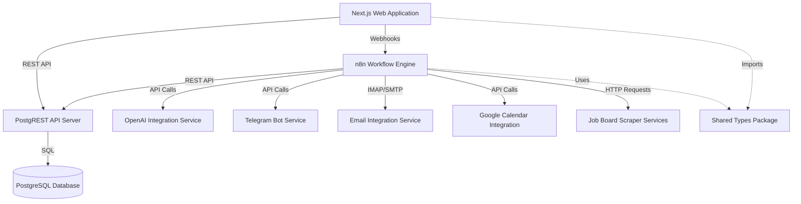

# Components

## System Components

The system consists of 9 major components:

## 1. Next.js Web Application

**Responsibilities**:
- User interface and interaction
- Authentication (NextAuth.js)
- API routes for custom business logic
- Server-side rendering (SSR)
- Static generation (SSG) for landing pages

**Key Technologies**:
- React 18 with App Router
- TypeScript for type safety
- Tailwind CSS for styling
- shadcn/ui for accessible components
- TanStack Query for server state
- Zustand for client state

**Interfaces Exposed**:
- HTTP endpoints for webhooks (`/api/webhooks/n8n`)
- OpenAI proxy endpoint (`/api/embeddings`)
- Health check endpoint (`/api/health`)

**Dependencies**:
- PostgREST for data operations
- n8n for workflow triggers
- OpenAI for embeddings (proxied)

---

## 2. PostgREST API Server

**Responsibilities**:
- Auto-generate REST API from PostgreSQL schema
- Handle authentication via JWT
- Enforce Row Level Security (RLS)
- Provide OpenAPI documentation

**Key Technologies**:
- PostgREST 12.x
- JWT validation
- HTTP/2 support

**Interfaces Exposed**:
- REST API (CRUD operations)
- RPC endpoints (PostgreSQL functions)
- OpenAPI schema (`/`)

**Dependencies**:
- PostgreSQL database
- JWT secret (shared with NextAuth)

**Rationale**: Eliminates need for hand-written API endpoints, reducing code maintenance and ensuring consistency.

---

## 3. PostgreSQL Database

**Responsibilities**:
- Primary data storage
- Vector search via pgvector
- Row Level Security enforcement
- Data integrity via constraints
- Trigger-based automation

**Key Technologies**:
- PostgreSQL 15+
- pgvector extension for embeddings
- pg_trgm for fuzzy text search
- pgcrypto for encryption

**Interfaces Exposed**:
- SQL interface (internal only)
- Replication slots for backups

**Dependencies**:
- None (foundational component)

**Rationale**: Industry-leading relational database with excellent extension ecosystem (pgvector critical for semantic search).

---

## 4. n8n Workflow Engine

**Responsibilities**:
- Job scraping automation
- AI customization orchestration
- Email monitoring and parsing
- Interview reminder scheduling
- Error handling and alerting

**Key Technologies**:
- n8n latest (self-hosted)
- Visual workflow editor
- 300+ integrations

**Interfaces Exposed**:
- Webhook endpoints for triggers
- HTTP API for workflow management
- Health check endpoint (`/healthz`)

**Dependencies**:
- PostgreSQL (workflow state storage)
- PostgREST (data operations)
- OpenAI, Telegram, Email, Calendar APIs

**Rationale**: Visual workflow editor enables rapid iteration without code changes. Built-in retry and error handling.

---

## 5. OpenAI Integration Service

**Responsibilities**:
- Resume and cover letter customization
- Email parsing and extraction
- Interview prep guide generation
- Job description embeddings

**Key Technologies**:
- OpenAI API (GPT-4o, GPT-4o-mini)
- text-embedding-3-small model

**Interfaces Exposed**:
- Called via HTTP by n8n and Next.js

**Dependencies**:
- OpenAI API key

**Rationale**: State-of-the-art AI for content generation. Embeddings API enables semantic search.

---

## 6. Telegram Bot Service

**Responsibilities**:
- Real-time notifications
- Mobile-first quick actions
- Inline keyboard interactions
- Status updates

**Key Technologies**:
- Telegram Bot API
- Webhook-based message handling

**Interfaces Exposed**:
- Bot commands and callbacks

**Dependencies**:
- Telegram Bot Token
- n8n (webhook handler)

**Rationale**: Mobile-first UX without building native app. Rich interactions via inline keyboards.

---

## 7. Email Integration Service

**Responsibilities**:
- IMAP monitoring for responses
- SMTP for sending applications
- Email parsing and classification

**Key Technologies**:
- IMAP protocol (Gmail, Outlook, custom)
- SMTP protocol
- OpenAI for parsing

**Interfaces Exposed**:
- Configured in n8n workflows

**Dependencies**:
- Email credentials (app-specific passwords)
- OpenAI for parsing

**Rationale**: Universal email protocol support. No vendor lock-in.

---

## 8. Google Calendar Integration Service

**Responsibilities**:
- Interview event creation
- Calendar sync
- Reminder scheduling

**Key Technologies**:
- Google Calendar API v3
- OAuth 2.0 authentication

**Interfaces Exposed**:
- Called via n8n HTTP Request nodes

**Dependencies**:
- Google OAuth credentials
- Refresh token (stored encrypted)

**Rationale**: Ubiquitous calendar platform. OAuth2 well-documented.

---

## 9. Job Board Scraper Services

**Responsibilities**:
- Fetch jobs from multiple sources
- Parse and normalize data
- Deduplicate by URL

**Sources**:
- Remote OK (API)
- We Work Remotely (scraping)
- Himalayas (API-like endpoint)
- Y Combinator Jobs (scraping)
- Wellfound (AngelList Talent)

**Key Technologies**:
- HTTP requests (APIs)
- HTML parsing (scraping)
- Rate limiting and retry logic

**Interfaces Exposed**:
- Executed via n8n scheduled workflows

**Dependencies**:
- Job board websites/APIs

**Rationale**: Multi-source strategy ensures job volume and diversity.

---

## 10. Shared Types Package

**Responsibilities**:
- TypeScript type definitions
- Shared across all TypeScript code
- Single source of truth for data shapes

**Key Technologies**:
- TypeScript 5.3+
- npm workspaces

**Interfaces Exposed**:
- TypeScript type exports

**Dependencies**:
- None

**Rationale**: Ensures type consistency across frontend, backend, and workflows.

---
