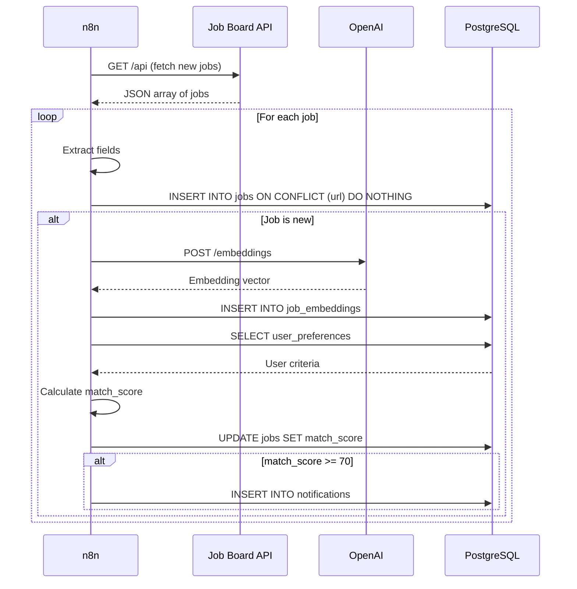
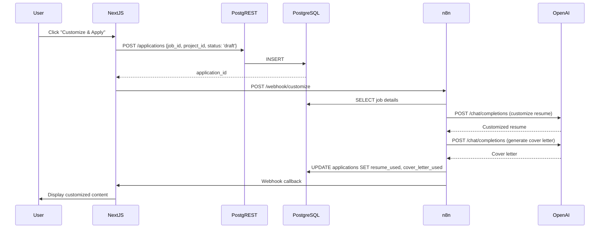
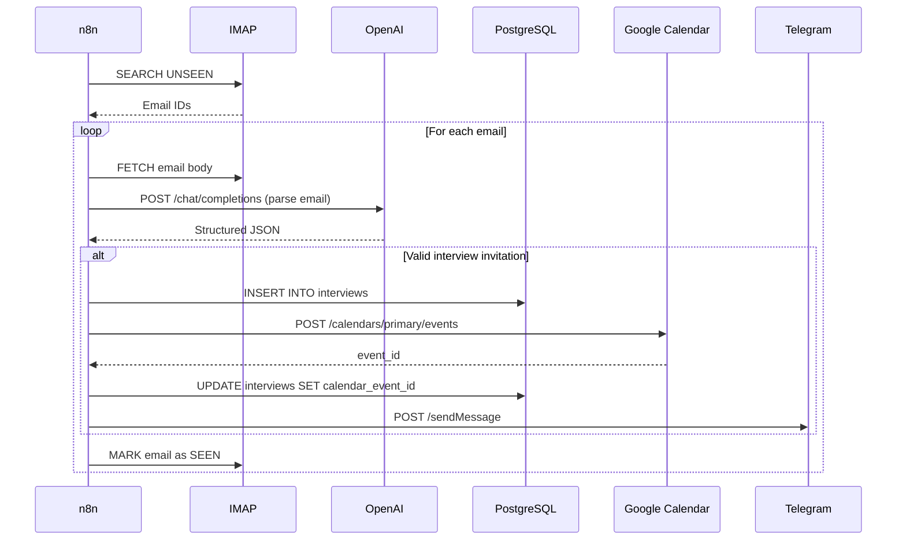
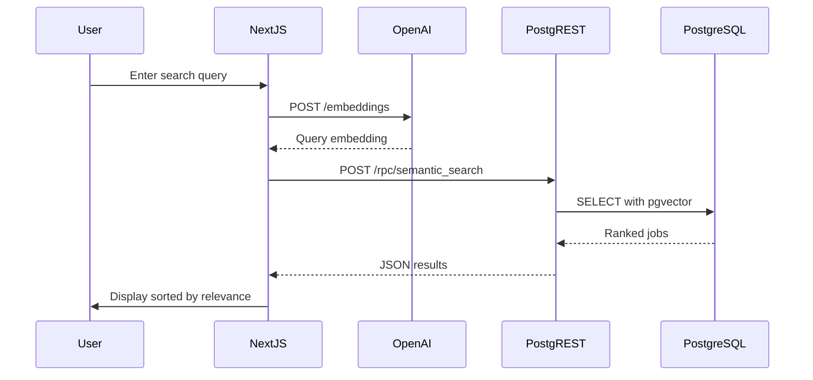

# Core Workflows

## Workflow 1: Job Discovery and Ingestion

**Trigger**: n8n scheduled workflow (every 4-6 hours)

**Process**:

**Key Steps**:
1. Fetch jobs from API/scraper
2. Deduplicate by URL
3. Generate embeddings via OpenAI
4. Calculate match score
5. Notify if high match

---

## Workflow 2: AI-Powered Resume/Cover Letter Customization

**Trigger**: User clicks "Customize & Apply" in web app

**Process**:

**Key Steps**:
1. Create draft application
2. Trigger n8n workflow
3. AI customization (2 OpenAI calls)
4. Store customized content
5. User reviews and approves

---

## Workflow 3: Email Response Monitoring

**Trigger**: n8n scheduled workflow (every 5 minutes)

**Process**:

**Key Steps**:
1. Poll IMAP for new emails
2. AI parsing to extract interview details
3. Create interview record
4. Sync to Google Calendar
5. Send Telegram notification

---

## Workflow 4: Semantic Job Search

**Trigger**: User enters natural language query

**Process**:

**Key Steps**:
1. Convert user query to vector embedding
2. Use pgvector cosine distance to find similar jobs
3. Return top 20 matches sorted by similarity

---
