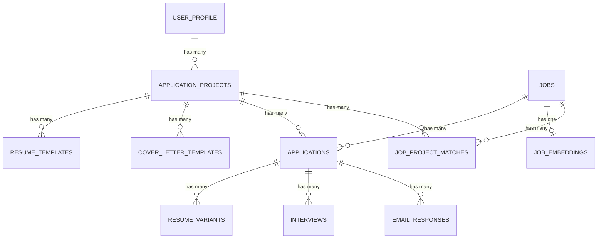

# Data Models

## Core Entities

All TypeScript interfaces are defined in `packages/types/src/` and shared across the monorepo.

### Job

```typescript
interface Job {
  id: string;
  title: string;
  company: string;
  url: string;                        // Unique constraint for deduplication
  description: string | null;
  tags: string[];
  seniority: 'junior' | 'mid' | 'senior' | 'lead' | 'executive' | null;
  source: 'remote_ok' | 'we_work_remotely' | 'himalayas' | 'yc_jobs' | 'wellfound';
  match_score: number | null;         // 0-100 calculated score
  scraped_at: string;                 // ISO 8601 timestamp
  is_archived: boolean;
  archived_at: string | null;
}
```

### Application

```typescript
interface Application {
  id: string;
  job_id: string;
  project_id: string;
  status: 'draft' | 'ready_to_apply' | 'applied' | 'no_response' | 'interview' | 'rejected' | 'offer' | 'accepted';
  resume_used: string | null;         // Snapshot of resume at time of application
  cover_letter_used: string | null;   // Snapshot of cover letter
  applied_at: string | null;
  submission_method: string | null;   // 'email', 'web_form', 'manual'
  created_at: string;
  updated_at: string;
}
```

### ApplicationProject

```typescript
interface ApplicationProject {
  id: string;
  user_id: string;
  name: string;                       // e.g., "Full-Stack Engineer Applications"
  description: string | null;
  target_roles: string[];
  target_companies: string[];
  created_at: string;
  updated_at: string;
}
```

### Interview

```typescript
interface Interview {
  id: string;
  application_id: string;
  scheduled_at: string;               // ISO 8601 timestamp
  duration_minutes: number;
  location: string | null;            // "Zoom: https://...", "Office: 123 Main St"
  round: string | null;               // "Phone Screen", "Technical Round 1", etc.
  interviewer_name: string | null;
  interviewer_email: string | null;
  prep_notes: string | null;          // AI-generated prep guide
  status: 'scheduled' | 'completed' | 'cancelled' | 'rescheduled';
  feedback: string | null;            // User's post-interview notes
  outcome: 'passed' | 'failed' | 'pending' | null;
  calendar_event_id: string | null;   // Google Calendar event ID
  created_at: string;
  updated_at: string;
}
```

### ResumeTemplate

```typescript
interface ResumeTemplate {
  id: string;
  project_id: string;
  name: string;
  content: string;                    // Markdown or plain text
  is_default: boolean;
  created_at: string;
  updated_at: string;
}
```

### CoverLetterTemplate

```typescript
interface CoverLetterTemplate {
  id: string;
  project_id: string;
  name: string;
  content: string;
  is_default: boolean;
  created_at: string;
  updated_at: string;
}
```

### JobEmbedding

```typescript
interface JobEmbedding {
  id: string;
  job_id: string;
  embedding: number[];                // 1536-dimensional vector (OpenAI text-embedding-3-small)
  model: string;                      // 'text-embedding-3-small'
  created_at: string;
}
```

### EmailResponse

```typescript
interface EmailResponse {
  id: string;
  application_id: string | null;     // Nullable for orphaned emails
  sender_email: string;
  subject: string | null;
  email_body: string;
  received_at: string;
  parsed_data: Record<string, unknown> | null;  // AI-extracted structured data
  confidence_score: number | null;    // 0.0-1.0
  response_type: 'interview_invite' | 'rejection' | 'acknowledgment' | 'other' | null;
  created_at: string;
}
```

### ResumeVariant

```typescript
interface ResumeVariant {
  id: string;
  application_id: string;
  content: string;
  version: number;
  generated_by: string | null;       // 'gpt-4o', 'gpt-4o-mini', 'manual'
  generation_prompt: string | null;
  created_at: string;
}
```

### JobProjectMatch

```typescript
interface JobProjectMatch {
  id: string;
  job_id: string;
  project_id: string;
  match_score: number;                // 0-100
  match_reasons: Record<string, unknown> | null;  // {"tags": [...], "seniority": "match"}
  user_rating: number | null;         // 1-5 stars for feedback
  is_dismissed: boolean;
  created_at: string;
}
```

### UserProfile

```typescript
interface UserProfile {
  id: string;
  email: string;
  full_name: string;
  target_roles: string[];
  must_have_tags: string[];
  nice_to_have_tags: string[];
  preferred_seniority: ('junior' | 'mid' | 'senior' | 'lead' | 'executive')[];
  min_match_score: number;            // Default: 70
  telegram_id: string | null;
  google_refresh_token: string | null;  // Encrypted
  email_password: string | null;      // Encrypted (IMAP/SMTP app password)
  email_provider: string;             // 'gmail', 'outlook', 'custom'
  imap_host: string | null;
  smtp_host: string | null;
  default_project_id: string | null;
  created_at: string;
  updated_at: string;
}
```

## Entity Relationships



---
