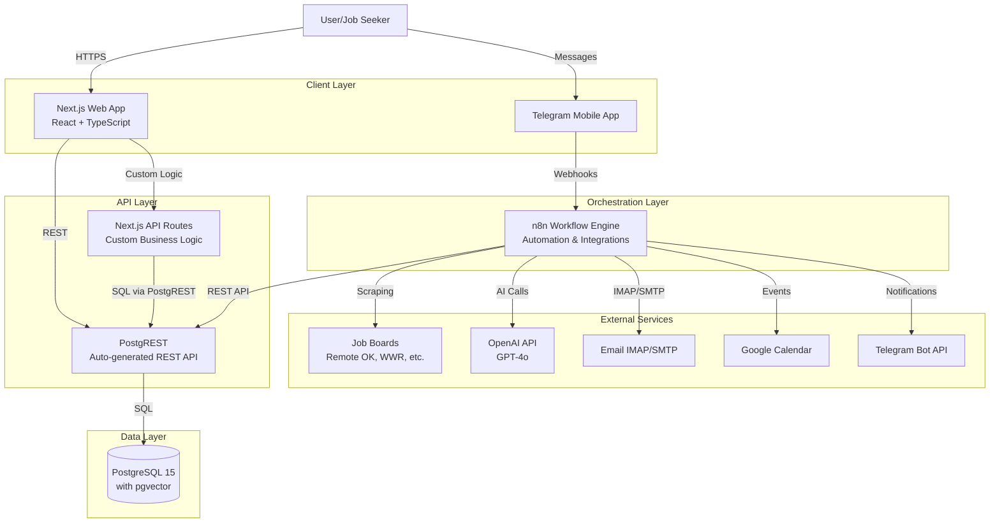

# High Level Architecture

## System Overview

## Architecture Patterns

**Pattern 1: Schema-Driven API**
- PostgreSQL schema defines data structure
- PostgREST reflects schema as REST endpoints
- Zero API code to maintain
- Row Level Security (RLS) for authorization

**Pattern 2: Workflow-Based Automation**
- n8n handles scheduled tasks (scraping, monitoring)
- Visual workflow editor for rapid iteration
- Error handling and retry logic built-in
- Webhook triggers for event-driven processing

**Pattern 3: Microservices on Railway**
- Each service (PostgreSQL, PostgREST, n8n, Next.js) runs independently
- Internal private network for service communication
- Auto-scaling and health monitoring
- Single platform deployment

**Pattern 4: AI-Powered Content Generation**
- OpenAI API for customization and parsing
- Vector embeddings (pgvector) for semantic search
- Caching to minimize API costs
- Fallback to templates when API unavailable

---
